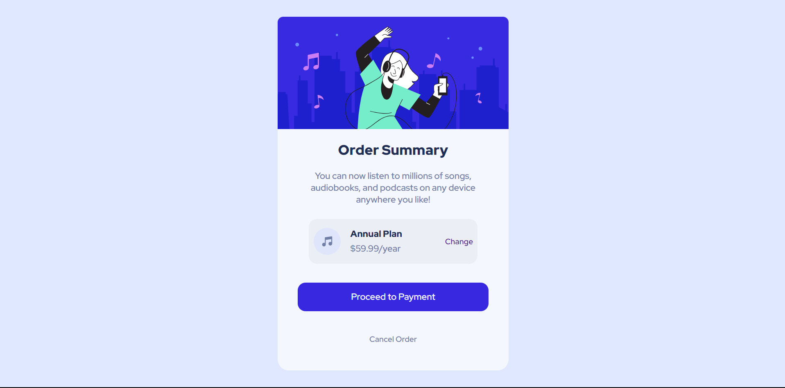

#  Order Summary - Frontend Mentor 


## Table of contents

- [Visão Geral](#visão-geral)
  - [Screenshot](#screenshot)
- [Meu processo](#meu-processo)
  - [Como foi feito](#construído-com)
  - [ O que eu aprendi](#o-que-eu-aprendi)
  - [Evolução](#evolução)
  - [Recursos úteis](#recursos-úteis)
- [Autor](#autor)


## Visão geral

### Screenshot




## Meu processo

### Construído com

- HTML5 Semântico
- CSS3 
- Flexbox

### O que eu aprendi

Com esse projeto consegui melhorar a centralização de itens, bem como a estilização de imagens, textos, assim como o uso do transition para realizar a transição da tela para a tela com o olho, no uso de variaveis assim facilitando a edição do conteúdo;


```css
.card-plan{
    display: flex;
    justify-content: space-around;
    align-items: center;
    max-width: 300px;
    max-height: 80px;
    margin: auto;
    position: absolute;
    top: 180px; left: 0; bottom: 10px; right: 0;
    height: 80px;
    border:  1px black;
    border-radius: 15px;
    background-color: rgba(27, 26, 26, 0.04);
}
```

### Evolução

Desejo focar mais na área Flex e Grid e na parte de transições do CSS para melhor estilização dos meus projetos, onde tenho certas dificuldades em centralizar os projetos;


### Recursos úteis

- [Resumo](https://angry-helicopter-3a6.notion.site/Resumos-DevQuest-d9c3dc80b08a4037a35ddb6d90355f0c) - Os meus resumos feitos com base no curso DEVQUEST me ajudaram bastante na criação desse projeto;

## Autor

- Github - [Willy-Braga](https://github.com/willy-braga)
- LinkedIn - [Willy Braga](https://www.linkedin.com/in/willy-braga-2861b3270/)
- Intragram - [@braga.wg](https://www.instagram.com/braga.wg/)

## Agradecimentos

Agradeço ao pessoal do curso [DEVQUEST](https://www.linkedin.com/school/devquest-dev-em-dobro/) por me ajudar na solução desse projeto com as aulas do curso.

